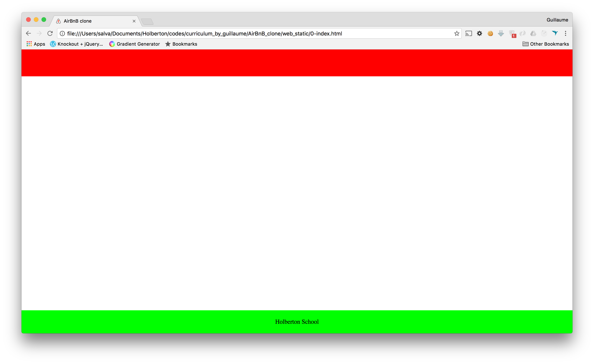

# 0x01. AirBnB clone - Web static

## About

This is an educational project to explore several conceptos about HTML and CSS

## Topics

-  What is HTML
-  How to create an HTML page
-  What is a markup language
-  What is the DOM
-  What is an element / tag
-  What is an attribute
-  How does the browser load a webpage
-  What is CSS
-  How to add style to an element
-  What is a class
-  What is a selector
-  How to compute CSS Specificity Value
-  What are Box properties in CSS

## Requirements

-  W3C compliant and validate with [W3C-Validator](https://github.com/holbertonschool/W3C-Validator)

Read or watch:

-  [Learn to Code HTML & CSS](https://learn.shayhowe.com/html-css/)
-  [Inline Styles in HTML](https://www.codecademy.com/articles/html-inline-styles)
-  [Specifics on CSS Specificity](https://css-tricks.com/specifics-on-css-specificity/)
-  [CSS SpeciFishity](http://www.standardista.com/wp-content/uploads/2012/01/specificity3.pdf)
-  [Introduction to HTML](https://developer.mozilla.org/en-US/docs/Learn/HTML/Introduction_to_HTML)
-  [CSS](https://developer.mozilla.org/en-US/docs/Learn/CSS)
-  [MDN](https://developer.mozilla.org/en-US/)
-  [center boxes](https://css-tricks.com/centering-css-complete-guide/)

## File Descriptions

This project is conceived to be carried out step by step, that is why the description of the files is presented as a statement.

**Background context**
Before developing a big and complex web application, we will build the front end step-by-step.

The first step is to “design” / “sketch” / “prototype” each element:

Create simple HTML static pages

-  Style guide
-  Fake contents
-  No Javascript
-  No data loaded from anything

During this project, you will learn how to manipulate HTML and CSS languages. HTML is the structure of your page, it should be the first thing to write. CSS is the styling of your page, the design. I really encourage you to fix your HTML part before starting the styling. Indeed, without any structure, you can’t apply any design.

### 0. Inline styling

**[0-index.html](0-index.html)**

Write an HTML page that displays a header and a footer.

Layout:

-  Body:
   -  no margin
   -  no padding
-  Header:
   -  color #FF0000 (red)
   -  height: 70px
   -  width: 100%
-  Footer:
   -  color #00FF00 (green)
   -  height: 60px
   -  width: 100%
   -  text `Holberton School` center vertically and horizontally
   -  always at the bottom at the page

Requirements:

-  You must use the `header` and `footer` tags
-  You are not allowed to import any files
-  You are not allowed to use the `style` tag in the `head` tag
-  Use inline styling for all your tags

### 1. Head styling

**[1-index.html](1-index.html)**

Write an HTML page that displays a header and a footer by using the `style` tag in the `head` tag (same as `0-index.html`)

Requirements:

-  You must use the `header` and `footer` tags
-  You are not allowed to import any files
-  No inline styling
-  You must use the `style` tag in the `head` tag

The layout must be exactly the same as `0-index.html`

### 2. CSS files

**[2-index.html](2-index.html)**  
**[styles/2-common.css](styles/2-common.css)**  
**[styles/2-header.css](styles/2-header.css)**  
**[styles/2-footer.css](styles/2-footer.css)**

Write an HTML page that displays a header and a footer by using CSS files (same as `1-index.html`)

Requirements:

-  You must use the `header` and `footer` tags
-  No inline styling
-  You must have 3 CSS files:
   -  `styles/2-common.css`: for global style (i.e. the body style)
   -  `styles/2-header.css`: for header style
   -  `styles/2-footer.css`: for footer style

The layout must be exactly the same as `1-index.html`

### 3. Zoning done!

**[3-index.html](3-index.htmll)**  
**[styles/3-common.css](styles/3-common.css)**  
**[styles/3-header.css](styles/3-header.css)**  
**[styles/2-footer.css](styles/3-footer.css)**

Write an HTML page that displays a header and a footer by using CSS files (same as `2-index.html`)

Layout:

-  Common:
   -  no margin
   -  no padding
   -  font color: #484848
   -  font size: 14px
   -  font family: `Circular,"Helvetica Neue",Helvetica,Arial,sans-serif;`
   -  [icon](https://s3.amazonaws.com/intranet-projects-files/holbertonschool-higher-level_programming+/268/icon.png) in the browser tab
-  Header:
   -  color: white
   -  height: 70px
   -  width: 100%
   -  border bottom 1px #CCCCCC
   -  [logo](https://s3.amazonaws.com/intranet-projects-files/holbertonschool-higher-level_programming+/268/logo.png) align on left and center vertically (20px space at the left)
-  Footer:
   -  color white
   -  height: 60px
   -  width: 100%
   -  border top 1px #CCCCCC
   -  text `Holberton School` center vertically and horizontally
   -  always at the bottom at the page

Requirements:

-  No inline style
-  You are not allowed to use the `img` tag
-  You are not allowed to use the `style` tag in the `head` tag
-  All images must be stored in the `images` folder
-  You must have 3 CSS files:
   -  `styles/3-common.css`: for the global style (i.e `body` style)
   -  `styles/3-header.css`: for the header style
   -  `styles/3-footer.css`: for the footer style
